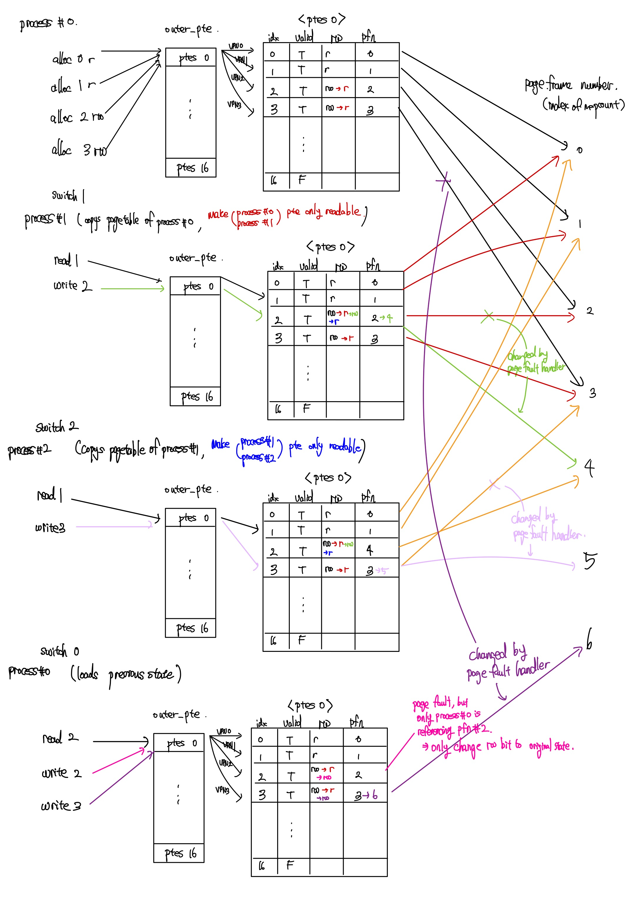

# Project #3: Virtual Memory Simulator

<https://git.ajou.ac.kr/parkjbdev/os-pa3/blob/main/REPORT.md>

## Abstract

이번 과제는 virtual memory simulator로, 프로세스가 읽을 수 있는 logical address (혹은 virtual address) 를 physical address로 변환해주는 MMU의 역할 중 일부를 수행하는 프로그램을 작성하는 것이다.

Logical address는 Virtual Page Number (혹은 VPN)와 Offset으로 나뉘고, MMU가 Page Table을 참조하여 VPN을 Page Frame Number (혹은 PFN)로 바꾸면 실제 Page가 저장되어 있는 Physical Address를 알아낼 수 있다.

이번 과제에서는 2 level hierachical page table을 사용하며, page table을 가리키는 outer page table가 정의되어있다.
즉, VPN을 두 부분으로 나누어 각각 outer page table의 index 와 page table의 index를 알아내어 VPN에 해당하는 PTE (Page Table Entry)를 찾아 PFN을 알아낼 수 있도록 한다.

## Page Allocation

주어진 `vpn`에 대해서 새로운 page를 할당하는 과정이다.

초기 구현과정에서 과제의 specification에 대해 혼동이 있어, `vpn`을 `pfn`으로 바꿔주는 것이 아닌, offset이 포함된 전체 virtual address를 pfn과 offset이 합해진 physical address로 바꾸어 주는 절차로 생각하였으나, virtual page number의 정의에 대해서 다시 생각해본 결과, virtual address의 offset은 고려하지 않아도 되는 사항임을 확인하였다.

### commit 2b08f40: Implement `alloc_page` and `free_page`

allocation 을 진행할 때, 주어진 `vpn`에 대해 해당하는 `pd_index`와 `pte_index`를 찾아 해당하는 page table entry에 접근해야 한다.
이를 위해서, 처음에는 비트 이동 연산자 `>>` 와 `<<`을 이용하여 다음과 같이 연산하는 방법을 고려하였다.

```c
pd_index = vpn >> PTES_PER_PAGE_SHIFT;
pte_index = vpn << (32 - PTES_PER_PAGE_SHIFT) >> (32 - PTES_PER_PAGE_SHIFT); // unsigned int uses 32bits
```

여기에서 고려하지 않아도 되는 offset까지 고려하려고 하는 바람에 (사실 offset bit이 몇 bit을 차지하는지 알 수도 없다.) 비트연산자로 계산이 복잡해지고, 올바른 방법인지 의심하던중, `vm.c`의 `__translate` 함수에서 vpn을 `NR_PTES_PER_PAGE`로 나눈값과 나눈 나머지의 값으로 index를 알아내는 것을 확인후에, 올바르게 접근하는 방법을 알 수 있었다.
위의 방법을 사용하여 `pd_index`와 `pte_index`를 알아낸 이후, `pte_directory`가 `NULL`로 선언되지 않은 상황일 때, 동적으로 할당해준 뒤에 올바른 page table entry들의 값을 할당해주며 초기화해주었다.

### commit 88c1a07: implement: `handle_page_fault`

read only page에 write를 시도할 경우, page fault가 발생하여 page fault handler가 동작한다.
이러한 상황에서, 이전에는 rw의 초기상태를 알 수 없어서, 해당 page가 read권한만 있는지, write권한도 있는지를 알 수 없었다.
이를 page fault handler에서 알 수 있게 하기 위해, 이전의 `pte`의 `private`멤버에는 아무것도 할당하지 않았으나, `rw`의 초기상태를 allocation 과정에서 저장해 주기로 하였다.

## Page Deallocation

주어진 `vpn`에 대해 해당하는 `pte`를 해제시켜주는 과정이다.
`alloc_page`에서와 같은 방식으로 `pd_index`와 `pte_index`를 계산하여 올바른 page table entry를 찾아간 뒤, `valid` bit을 `false`로 바꿔주는 과정이 주요한 요소이다. 이때, 해당하는 `pfn`을 referencing 하는 프로세스가 하나 줄어든 것이므로, `mapcounts[pfn]`의 값도 1만큼 감소시켜준다.

### commit 2b08f403: Implement `alloc_page` and `free_page`

초기에 구현할 때, `pte`에 대한 혼동이 있어, 다른 프로세스도 공유한다고 생각하였는지, 현재 프로세스만 유일하게 해당 page frame을 참조하고 있을 때, `valid` bit을 false로 변경하는.. 코드를 작성하였는데, 이는 버그이다.
당연하게도, 각 프로세스마다 `pagetable`이 따로 존재하며, `free`를 한다는 것은 더이상 해당 page table entry가 `valid`하지 않은 entry라는 것이기 때문에, 그러한 조건을 확인할 필요 없이, `valid` bit을 `false`로 바로 바꾸어주면 된다. 이는 commit d89cd9e6에서 수정되었다.

## Fork

새로운 프로세스를 생성할 때, `switch_process`에서 fork하는 과정을 거쳐 생성한다.
즉, 새로운 프로세스를 생성할 때, 기존 프로세스에서 사용된 모든 메모리 정보들이 새로운 프로세스에 똑같이 복사된다.
이번 fork에서는 `process` dependent 한 정보인 `pid`와 `list` 멤버는 올바른 값으로 초기화시켜주고, `pagetable`을 그대로 복사해 주었다.
`pagetable`을 복사하기 전 Copy on write의 구현을 위해 전처리하는 과정을 거친다. 그 과정은 추후 자세히 설명한다.

기존에 switch하려던 process가 존재하지 않을 경우 위와 같이 fork를 진행하며 `pagetable`을 복사해야 한다.
이 과정을 처음에는 단순히 `memcpy`를 이용하여 복사하였으나, 이렇게 복사할 경우 `pagetable`을 shallow copy 한 것이 되어, 서로 다른 process 이더라도 같은 주소값을 참조하는 결과를 디버깅을 통해 확인하였다.
따라서 이를 해결하기 위해 `malloc`을 통해 다시 동적으로 메모리를 할당하며, outer_pte와 ptes 모두 다른 주소공간에 같은 값을 복사할 수 있도록 `pagetable`을 deep copy해주는 함수 `clone_pagetable`을 통해 `pagetable`을 복제하여 새로운 프로세스에 할당해주었다.

이 과정역시 copy on write을 이용하여 구현할 수는 있겠으나, 구현의 복잡성 때문에 우선 단순 deep copy하는 방식을 취하였다.

## Copy on Write

우선 다른 얘기이지만, Apple WWDC 2017에서 새롭게 소개된 APFS 파일 시스템을 소개할 때, copy on write이라는 것을 처음 접해보았다.
당시에, 이러한 방법을 사용하면 파일을 논리적으로 복사할 때 속도도 빠르고, 물리적인 저장공간도 적게 사용할 수 있다는 점에서 센세이셔널하게 느꼈던 기억이 있다.

약 6년이 지나고 운영체제 수업을 들으며 copy on write을 오랜만에 다시듣고, 간단하게 구현해보게 된다는 점에서 개인적으로 흥미를 느꼈다.
APFS의 Storage 차원의 CoW와 달리, 이번 과제에서의 CoW은 Memory 단에서 동작한다.

말 그대로, copy on write은 copy를 lazy하게, write을 시도할 때 그제서야 copy를 하는 방법을 뜻한다. 그 구현은 다음의 일련의 과정과 같다.

- process fork를 시도하면, `pte`들의 `rw` bit을 read-only하게 바꾸어준다.
- 그리고, 같은 page table을 deep copy하여 새로운 프로세스에 할당해 주면, 서로 다른 `pagetable`에서 같은 `pfn`을 참조한다.
- 하지만, 부모 프로세스와 자식 프로세스 모두 `pte`의 `rw` bit이 read-only 하기 때문에, write을 시도할 경우 page fault가 발생한다.
- 이와 같이 page fault가 발생할 경우, page fault handler에서 해당 page frame을 참조하는 프로세스의 개수(`mapcounts`)를 확인한다.
  - `mapcounts[pfn] == 1`일 경우는 현재 프로세스만 해당 page frame을 참조하고 있는 상황으로 기존의 `rw` 권한을 복구시켜 준다.
  - `mapcounts[pfn] > 1`일 경우, 현재 프로세스 외에 다른 프로세스도 해당 page frame을 참조하고 있는 상황으로, page frame에 함부로 write 할 경우, 다른 process에 영향을 미치게 된다. 따라서, 새로운 page frame에 기존의 page frame을 복사하여 새로운 page frame을 참조하도록 `pfn`을 변경해준다.

이를 구현하기 위해, `switch_process`의 `fork` 과정에서, `pagetable`을 복사하기 전에, `valid`한 `pte`에 대해서 `mapcounts[pfn]`을 1증가시키고, `rw` bit을 read-only하게 변경해준뒤, `pagetable`을 새로운 process에 deep copy 해주었다.
`handle_page_fault`에서는 read-only page에 write을 시도하여 page fault가 발생하였을 때, 위에서 언급한대로 핸들링하였다.

즉, commit 39eb584d와 88c1a070이 사실상 copy on write을 구현한 commit이라고 보아도 무방하다.

### Testcase: `testcases/cow-2`

우선, `testcases/cow-2`의 경우, `NR_PTES_PER_PAGE=16`을 넘어가는 vpn 주소의 할당은 없다.
따라서, 모든 vpn의 `outer_ptes`는 0번째 `ptes`가 되므로 편의를 위해 `outer_ptes`에 대한 언급은 가급적 생략하도록 하겠다.

#### allocation (@process #0)

먼저, process #0에서 vpn 0(r) 1(r) 2(rw) 3(rw)의 allocation이 진행된다.
앞에서 언급했듯이, `outer_ptes`의 index는 0이고, 0번째 `ptes`는 다음과 같이 구성된다.

| index | valid | rw  | pfn | private |
| :---: | :---: | :-: | :-: | :-----: |
|   0   |   T   |  r  |  0  |    r    |
|   1   |   T   |  r  |  1  |    r    |
|   2   |   T   | rw  |  2  |   rw    |
|   3   |   T   | rw  |  3  |   rw    |

#### switch (process #0 -> process #1)

process #0 에서 process #1로 현재 실행중인 프로세스가 변경되었다.
이때, process #1은 이전에 실횅된 적이 없는 프로세스로, process #0를 `fork`하여 새로운 프로세스를 만들게 된다.
그 결과, process #1의 `pagetable`은 process #0의 `pagetable`과 같은 값을 가진다.
다만, copy on write을 위해서, process #0의 pagetable을 process #1로 복사하기 전에 pte가 모두 `ACCESS_READ` 권한만 가지도록 하여, `write`을 할 수 없도록 한다.
만약, 추후 `write`을 시도한다면, page fault가 발생하는데, 이때, page fault handler가 `mapcounts`를 확인하여 해당 page를 reference 하고 있는 process가 여러 개일 경우, 새로운 pfn을 할당 및 복사하여 해당 page frame에서 `write`이 가능하도록 변경한다.
따라서, process #0과 process #1의 pte는 fork 된 후 다음과 같이 변경 혹은 할당된다.

##### pagetable of both process #0 and process #1 (identical) after `switch 1`

| index | valid |  rw   | pfn | private |
| :---: | :---: | :---: | :-: | :-----: |
|   0   |   T   |   r   |  0  |    r    |
|   1   |   T   |   r   |  1  |    r    |
|   2   |   T   | **r** |  2  |   rw    |
|   3   |   T   | **r** |  3  |   rw    |

##### read & write on process #1

process #1의 `read 1`의 경우 read 권한이 있으므로 문제없이 동작한다.

process #1의 `write 2`의 경우 fork를 하면서 write 권한이 사라졌기 때문에, 앞에서 언급했듯, page fault handler가 기존에 write가 가능한 page인지 확인 후, 가능하다면 새로운 pfn을 찾아서 할당 및 복사해준다.
이번 경우, pfn 4번이 비어있는 가장 빠른 pfn이므로, 기존 2번의 page frame을 4번의 page frame에 복사하여 write 권한을 부여한다.
따라서, process #1의 pte는 다음과 같이 변경된다.

##### pagetable of process #1 after `read 1` and `write 2`

| index | valid |   rw   |  pfn  | private |
| :---: | :---: | :----: | :---: | :-----: |
|   0   |   T   |   r    |   0   |    r    |
|   1   |   T   |   r    |   1   |    r    |
|   2   |   T   | **rw** | **4** |   rw    |
|   3   |   T   |   r    |   3   |   rw    |

#### switch (process #1 -> process #2)

process #1 에서 process #2로 현재 실행중인 프로세스가 변경되었다.
마찬가지로, process #2은 이전에 실횅된 적이 없는 프로세스로, process #0를 `fork`하여 새로운 프로세스를 만들면, read권한만 있는 pte들이 복사되어 다음과 같다.

##### pagetable of both process #1 and process #2 (identical) after `switch 1`

| index | valid |  rw   | pfn | private |
| :---: | :---: | :---: | :-: | :-----: |
|   0   |   T   |   r   |  0  |    r    |
|   1   |   T   |   r   |  1  |    r    |
|   2   |   T   | **r** |  4  |   rw    |
|   3   |   T   |   r   |  3  |   rw    |

##### read & write on process #2

process #2에서 `read 1`을 시도하면, 위의 pagetable에서 1번째 index pte를 거쳐 문제없이 읽을 수 있다.
process #2에서 `write 3`을 시도하면, 3번째 index pte는 read 권한만 가지고 있기 때문에 page fault가 발생하고, page fault handler가 기존 권한을 확인한 후 새로운 pfn를 찾아서 할당해준다.
이번 경우, pfn 5번이 비어있는 가장 작은 pfn으로, 다음과 같이 pagetable이 변경된다.

##### pagetable of process #2 after `read 1` and `write 3`

| index | valid |   rw   | pfn | private |
| :---: | :---: | :----: | :-: | :-----: |
|   0   |   T   |   r    |  0  |    r    |
|   1   |   T   |   r    |  1  |    r    |
|   2   |   T   |   r    |  4  |   rw    |
|   3   |   T   | **rw** |  5  |   rw    |

#### switch (process #2 -> process #0)

process #0은 기존에 생성되어 있던 프로세스로, `processes`에서 불러온다.
process #0의 마지막 상태의 pagetable은 다음과 같았다.

##### pagetable of process #0 after `switch 0` (loads last state of process #0's pagetable)

| index | valid | rw  | pfn | private |
| :---: | :---: | :-: | :-: | :-----: |
|   0   |   T   |  r  |  0  |    r    |
|   1   |   T   |  r  |  1  |    r    |
|   2   |   T   |  r  |  2  |   rw    |
|   3   |   T   |  r  |  3  |   rw    |

이때, `read 2`의 경우 정상적으로 pagetable을 확인하여 읽어올 수 있다.

`write 2`를 할 경우, 2번 index는 read권한만 있기 때문에, page fault가 발생하여 page fault handler가 동작한다.
하지만, `mapcounts` 배열에서 pfn 2를 참조하는 process가 자신으로 하나뿐이기 때문에, rw 권한으로 바꾸어도 다른 프로세스에 영향을 미치지 않는다.
따라서 rw 권한으로 바꾼 뒤, pfn 2에 write을 한다.

##### pagetable of process #0 after `write 2`

| index | valid | rw  | pfn | private |
| :---: | :---: | :-: | :-: | :-----: |
|   0   |   T   |  r  |  0  |    r    |
|   1   |   T   |  r  |  1  |    r    |
|   2   |   T   | rw  |  2  |   rw    |
|   3   |   T   |  r  |  3  |   rw    |

`write 3`을 할 경우, 3번 index는 read 권한만 있기 때문에, page fault가 발생하여 page fault handler가 동작한다.
2번 pfn과 달리 3번 pfn의 경우 현재 process #1 역시 참조하고 있는 상황이기 때문에 `mapcounts`에서 확인한 reference count는 2가 되며, 이에 따라 새로운 pfn을 할당해주어야 한다.
따라서, 가장 작은 사용하지 않은 pfn인 6번을 할당후 rw권한을 부여해서 write를 할 수 있도록 변경된다.

위와 같은 과정을 거친 process #0의 pagetable은 다음과 같다.

##### pagetable of process #0 after `write 3`

| index | valid | rw  | pfn | private |
| :---: | :---: | :-: | :-: | :-----: |
|   0   |   T   |  r  |  0  |    r    |
|   1   |   T   |  r  |  1  |    r    |
|   2   |   T   | rw  |  2  |   rw    |
|   3   |   T   | rw  |  6  |   rw    |

결국, 세 프로세스의 최종 pagetable의 상태는 다음과 같이 구성된다.

<table>

  <th>Process #0</th>
  <th>Process #1</th>
  <th>Process #2</th>

  <tr>
    <td>
      <table>
      <thead>
      <tr>
      <th style="text-align:center">index</th>
      <th style="text-align:center">valid</th>
      <th style="text-align:center">rw</th>
      <th style="text-align:center">pfn</th>
      <th style="text-align:center">private</th>
      </tr>
      </thead>
      <tbody>
      <tr>
      <td style="text-align:center">0</td>
      <td style="text-align:center">T</td>
      <td style="text-align:center">r</td>
      <td style="text-align:center">0</td>
      <td style="text-align:center">r</td>
      </tr>
      <tr>
      <td style="text-align:center">1</td>
      <td style="text-align:center">T</td>
      <td style="text-align:center">r</td>
      <td style="text-align:center">1</td>
      <td style="text-align:center">r</td>
      </tr>
      <tr>
      <td style="text-align:center">2</td>
      <td style="text-align:center">T</td>
      <td style="text-align:center">rw</td>
      <td style="text-align:center">2</td>
      <td style="text-align:center">rw</td>
      </tr>
      <tr>
      <td style="text-align:center">3</td>
      <td style="text-align:center">T</td>
      <td style="text-align:center">rw</td>
      <td style="text-align:center">6</td>
      <td style="text-align:center">rw</td>
      </tr>
      <tr>
      <td style="text-align:center">...</td>
      <td style="text-align:center"></td>
      <td style="text-align:center"></td>
      <td style="text-align:center"></td>
      <td style="text-align:center"></td>
      </tr>
      <tr>
      <td style="text-align:center">15</td>
      <td style="text-align:center">F</td>
      <td style="text-align:center"></td>
      <td style="text-align:center"></td>
      <td style="text-align:center"></td>
      </tr>
      </tbody>
      </table>
    </td>
    <td>
      <table>
      <thead>
      <tr>
      <th style="text-align:center">index</th>
      <th style="text-align:center">valid</th>
      <th style="text-align:center">rw</th>
      <th style="text-align:center">pfn</th>
      <th style="text-align:center">private</th>
      </tr>
      </thead>
      <tbody>
      <tr>
      <td style="text-align:center">0</td>
      <td style="text-align:center">T</td>
      <td style="text-align:center">r</td>
      <td style="text-align:center">0</td>
      <td style="text-align:center">r</td>
      </tr>
      <tr>
      <td style="text-align:center">1</td>
      <td style="text-align:center">T</td>
      <td style="text-align:center">r</td>
      <td style="text-align:center">1</td>
      <td style="text-align:center">r</td>
      </tr>
      <tr>
      <td style="text-align:center">2</td>
      <td style="text-align:center">T</td>
      <td style="text-align:center">rw</td>
      <td style="text-align:center">4</td>
      <td style="text-align:center">rw</td>
      </tr>
      <tr>
      <td style="text-align:center">3</td>
      <td style="text-align:center">T</td>
      <td style="text-align:center">r</td>
      <td style="text-align:center">3</td>
      <td style="text-align:center">rw</td>
      </tr>
      <tr>
      <td style="text-align:center">...</td>
      <td style="text-align:center"></td>
      <td style="text-align:center"></td>
      <td style="text-align:center"></td>
      <td style="text-align:center"></td>
      </tr>
      <tr>
      <td style="text-align:center">15</td>
      <td style="text-align:center">F</td>
      <td style="text-align:center"></td>
      <td style="text-align:center"></td>
      <td style="text-align:center"></td>
      </tr>
      </tbody>
      </table>
    </td>
    <td>
      <table>
      <thead>
      <tr>
      <th style="text-align:center">index</th>
      <th style="text-align:center">valid</th>
      <th style="text-align:center">rw</th>
      <th style="text-align:center">pfn</th>
      <th style="text-align:center">private</th>
      </tr>
      </thead>
      <tbody>
      <tr>
      <td style="text-align:center">0</td>
      <td style="text-align:center">T</td>
      <td style="text-align:center">r</td>
      <td style="text-align:center">0</td>
      <td style="text-align:center">r</td>
      </tr>
      <tr>
      <td style="text-align:center">1</td>
      <td style="text-align:center">T</td>
      <td style="text-align:center">r</td>
      <td style="text-align:center">1</td>
      <td style="text-align:center">r</td>
      </tr>
      <tr>
      <td style="text-align:center">2</td>
      <td style="text-align:center">T</td>
      <td style="text-align:center">r</td>
      <td style="text-align:center">4</td>
      <td style="text-align:center">rw</td>
      </tr>
      <tr>
      <td style="text-align:center">3</td>
      <td style="text-align:center">T</td>
      <td style="text-align:center">rw</td>
      <td style="text-align:center">5</td>
      <td style="text-align:center">rw</td>
      </tr>
      <tr>
      <td style="text-align:center">...</td>
      <td style="text-align:center"></td>
      <td style="text-align:center"></td>
      <td style="text-align:center"></td>
      <td style="text-align:center"></td>
      </tr>
      <tr>
      <td style="text-align:center">15</td>
      <td style="text-align:center">F</td>
      <td style="text-align:center"></td>
      <td style="text-align:center"></td>
      <td style="text-align:center"></td>
      </tr>
      </tbody>
      </table>
    </td>
  </tr>
</table>

<!-- ##### Process #0

| index | valid | rw  | pfn | private |
| :---: | :---: | :-: | :-: | :-----: |
|   0   |   T   |  r  |  0  |    r    |
|   1   |   T   |  r  |  1  |    r    |
|   2   |   T   | rw  |  2  |   rw    |
|   3   |   T   | rw  |  6  |   rw    |
|  ...  |       |     |     |         |
|  15   |   F   |     |     |         |

##### Process #1

| index | valid | rw  | pfn | private |
| :---: | :---: | :-: | :-: | :-----: |
|   0   |   T   |  r  |  0  |    r    |
|   1   |   T   |  r  |  1  |    r    |
|   2   |   T   | rw  |  4  |   rw    |
|   3   |   T   |  r  |  3  |   rw    |
|  ...  |       |     |     |         |
|  15   |   F   |     |     |         |

##### Process #2

| index | valid | rw  | pfn | private |
| :---: | :---: | :-: | :-: | :-----: |
|   0   |   T   |  r  |  0  |    r    |
|   1   |   T   |  r  |  1  |    r    |
|   2   |   T   |  r  |  4  |   rw    |
|   3   |   T   | rw  |  5  |   rw    |
|  ...  |       |     |     |         |
|  15   |   F   |     |     |         | -->

다시한번 그 과정을 도식화하면 다음과 같다.



## TLB

TLB는 Translation Look-aside Buffer을 줄인말로, principle of locality 특성 때문에 이전에 읽거나 쓴 값은 앞으로도 읽거나 쓸 가능성이 높아 buffer에 해당 pte에 관한 정보를 적어두어 `pagetable`을 직접 참조하지 않고도, pte에 더욱 빠른 접근을 가능하게 하는 buffer이다.
본래 의도는 pte에 더욱 빠르게 접근하기 위한 것이지만, 이번 과제에서는 tlb에서 일치하는 `vpn`을 찾는 과정에서 for loop을 거치기 때문에, 오히려 더 느릴 가능성이 존재하기는 하다.
다만, 간단한 시뮬레이터임을 가정하므로 이러한 차이는 우선 무시하도록 한다.

TLB를 구현할 때, process간 스위치가 되었을 경우에 대해 TLB를 어떻게 update 시켜야 할지에 대한 고민이 있었다.
processs를 switch 할 때, 이전의 pid를 `private` 멤버에 저장하는 방법으로 즉, Address-Space Identifiers (ASIDs) 를 이용하는 방법도 존재하고, 그냥 tlb flush 시키는 방법도 있기 때문이다.
하지만 결국 구현의 편의 때문에 tlb flush 시키는 방법을 선택하였다.

또, 이번 과제에서는 입력이 적어 고려되지 않았지만, TLB entry가 `NR_TLB_ENTRIES`를 넘어 victim을 골라야 하는 상황이 발생할 수 있다.
이러한 경우가 생긴다면, Belady's Algorithm, FIFO, LRU 등등의 방법을 이용하여 victim page를 선택하여 해당 tlb entry 를 free시켜 사용하면 될 것이다.

`read` 혹은 `write` operation을 하였을 때, 해당 vpn이 tlb에 적혀있는지 `lookup_tlb`를 통해서 참조하는 과정을 거친다.
만약 해당 `vpn`에 대한 tlb entry가 존재할 경우, tlb hit 된것으로 판단하여 tlb에 적혀진 `pfn`을 보고 MMU가 `vpn`을 변환하게 된다.
하지만 tlb hit이 나지 않았을 경우, 추후에 참조할 가능성을 고려해서 tlb에 `pte`의 정보를 작성해주어야 한다.
이를 위해서 먼저 주어진 `vpn`에 매칭하는 `pte`를 찾아 `rw` bit, `pfn` 값 등을 참조한다.
이렇게 읽어온 값들을 `insert_tlb`에서 tlb에 삽입 혹은 update하게 되는 과정을 구현하면 tlb에 대한 주요 구현은 마무리 되었다.

하지만, 사소하게 신경써주어야 하는것들로, pte의 값들이 바뀌었을 때, tlb의 값도 변경해서 update 해주어야 한다는 점이다.
이번 과제의 경우, testcase에서 이를 검출하는 case는 존재하지 않아 문제없이 통과하였지만, 이를 고려하지 않는다면, page fault가 난 이후 write 하는 과정에서 tlb와 pte에 저장된 rw bit이나 pfn 값이 달라 문제가 발생할 수 있다.
이러한 문제점을 인지하고, commit 253cc7f7에서 수정하였다.
