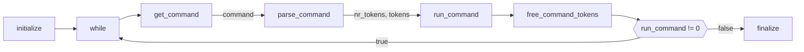
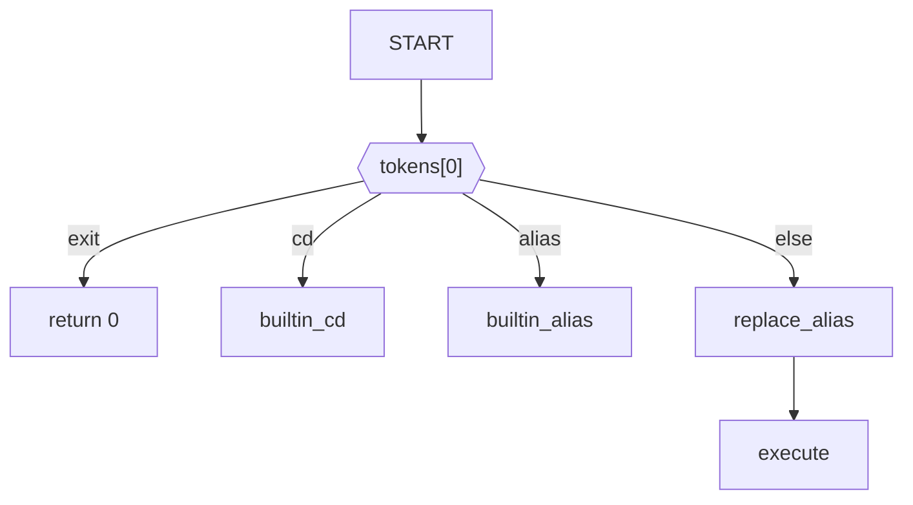
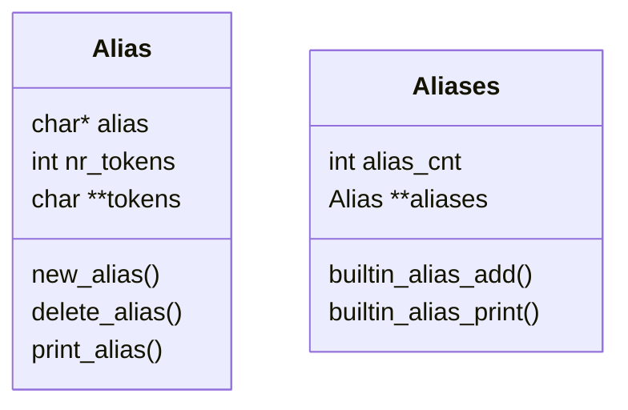
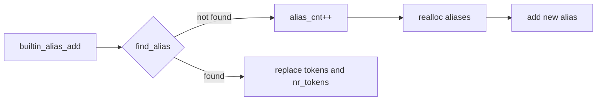
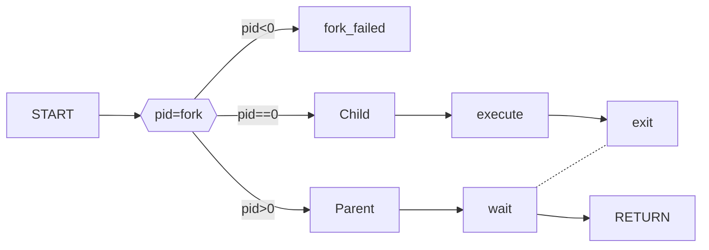
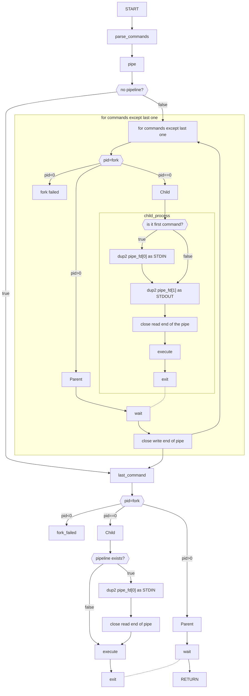

# Project #1: My Amazing Shell Report

## Logic

### `mash.c`

`mash.c`에서는 command를 실행하기 전에 command를 입력받고, 이를 `parser.c`에 정의된 `parse_command` 함수를 통해 공백을 기준으로 command를 토큰화하여 `run_command`에 전달하여 command를 실행한 뒤, 메모리에서 token들을 해제하는 과정을 거친다. 위 flowchart에 그 과정과 인자들의 전달을 모식화해두었다.

### `pa1.c`

`pa1.c` 에서는 우선 첫번째 입력된 토큰 `tokens[0]`가 builtin function인지 판단하여, builtin function일 경우 `nr_tokens`에 따라 올바른 동작을 수행할 수 있도록 하였다. builtin function이 아닐 경우, 즉, 명령어를 실행해야 될 경우에는 우선 alias로 등록된 token이 있는지 확인하여 이를 대체하는 과정을 거친 후 `execute`함수를 통해 실행하게 된다. 위는 간단한 flowchart이다. 각각의 함수의 동작과정에 대해서는 아래에 기술하였다.

## Features

### Builtin Command - `cd`

cd 기능은 현재의 working directory를 바꾸는 명령어로, `builtin_cd` 함수로 실행되는데, 인자로 변경할 디렉토리의 주소 `dir`이 입력되면, 이에 맞는 곳으로 이동한다.

전달된 인자가 `~`일 경우 `getenv` 를 이용하여 환경변수 목록중에서 `$HOME` 환경변수를 찾아 home directory 로 이동할 수 있도록 하였다. 또, `cd`만 입력되었을 때 역시 home directory로 이동해야 하는데, 이는 `run_command` 함수에서 전달된 인자가 1개일 때에는 `builtin_cd("~")`가 실행되도록 하여 의도한 동작을 수행할 수 있도록 하였다.

`cd` 명령어가 성공적으로 실행되었을 때에 `builtin_cd` 함수는 1을 반환하고, 그렇지 않을 경우 `perror`를 통한 에러메세지와 함께 -1을 반환하도록 하였다.

#### 추가구현 - 이전 directory 이동: `-`

추가적으로 전달된 인자가 `-`일 경우 이전 디렉토리를 저장해두는 기능을 구현하였다. 이를 위해 디렉토리를 이동할 때마다, 환경변수에 등록된 `$PWD`값과 `$OLDPWD`값을 `setenv`를 통해 다시 설정하여 주었다.

#### Lessons Learned

cd 기능을 구현하며 환경변수를 읽고 쓰는 `getenv`, `setenv` 함수, current working directory를 읽고 변경하는 `getcwd`, `chdir` 함수를 알게되었다.

### Builtin Command - `alias`

alias 기능은 기존에 `run_command`로 입력된 `tokens` 중에 alias로 등록되어 있는 token들을 매치되는 token들로 대체하는 방식으로 기능을 구현하였다.

이를 구현하기 위해서 하나의 alias에 대한 정보를 담는 구조체 `Alias` 를 정의하였으며, 해당 구조체의 member로, 대체될 문자열 `alias`, 해당 alias에 대해 대체시켜야 할 토큰들의 배열 `tokens`, `tokens` 배열의 길이를 저장하는 `nr_tokens`를 정의하였다. 새로운 alias를 동적할당하거나 메모리에서 해제할 때, 편의를 위해 `new_alias`, `delete_alias` 함수를 정의하여 이용하였다.
또, 여러 alias 정보들을 저장하는 `Alias`의 배열 `Alias **aliases` 과 총 alias들의 개수 `alias_cnt`를 정의하였다.
이를 간단한 다이어그램으로 나타내면 다음과 같다.

#### 새로운 alias 추가과정 - `builtin_alias_add`

새로운 alias를 추가하는 일련의 과정은 다음과 같다.

즉, alias를 추가하기 전에, `find_alias` 함수를 통해 aliases 배열에 기존에 등록된 같은 이름의 alias가 존재하는지 확인한 후, 같은 alias가 존재할 경우 이를 새로운 `tokens`와 `nr_tokens`로 대체하고, 기존에 같은 alias가 존재하지 않을 경우 새로운 alias를 추가하기 위해 `aliases` 배열을 `alias_cnt+1` 만큼 재할당해주어 새로운 alias를 등록해주는 과정을 거친다.

#### alias 출력 - `builtin_alias_print`

`builtin_alias_print` 함수는 초기에는 모든 alias들을 출력하는 함수로 만들었으나, 개별 alias에 대해서 출력할 수 있도록 개선하였다.
이를 위해 `run_command`에서 `alias`만 입력되어 token이 1개 입력된 경우, `alias`와 함깨 token이 2개 입력된 경우, 즉 `alias ll`과 같은 경우를 나누어 `builtin_alias_add`에 인자로 전달하였다.
해당 함수에 `NULL`값이 들어올 경우, 모든 alias들을 출력하도록 하였고, 문자열이 들어올 경우 해당하는 alias를 `find_alias`를 통해 찾아서 출력하도록 하였다.

#### alias replacement

builtin commands가 아닌 경우, `execute`을 통하여 command를 실행하기 전에, `tokens`를 순회하며 alias로 대체할 token이 있는지 확인하는 과정을 거친다. alias로 대체할 token이 존재한다면, 이를 대체하기 위해서 `tokens[]` 배열의 뒷부분을 alias의 token 개수만큼 미루는 작업을 진행한다.
그리고 alias가 있던 index부터 미뤄진 만큼의 index에 alias token들을 넣는과정을 진행한다.

최종적으로, aliasing 된 token들의 aliasing을 방지하기 위해 for loop을 순회하는 iterator `i`를 밀어낸 인덱스만큼 증가시켜 주었다. (ex. alias hello hi hello; echo hello world 의 실행결과는 hi hello world 여야 함, re-aliasing을 할 경우 무한히 긴 문자열이 생성됨)

#### 메모리 해제

최종적으로 쉘을 terminate하기 전에 동적할당한 `aliases`의 개별 element와 `aliases`을 `finalize` 함수에서 해제해주었다.

#### Lessons Learned

alias 기능을 구현하며 메모리를 동적으로 할당하고 해제하는 과정을 통해 포인터와 이를 활용한 동적길이를 가진 배열에 대한 이해도를 향상시킬 수 있었다.
특히, 문자열을 복사할 때, 기존에는 `malloc`을 통해 문자열을 저장하는 공간을 동적으로 만들고, 여기에 `strcpy`를 통해 복사하고는 하였는데, 이를 한번에 해주는 `strdup`이라는 유용한 함수를 알게되었다.

### Execution & Pipe Implementation - `execute`

새로운 프로세스의 실행과 pipelining 부분의 logic에서 겹치는 부분이 발생하여 같은 section으로 포함한다.

우선 `execute`을 실행하기 전에, `tokens`와 `nr_tokens`를 입력받아 이를 파이프라인 기호 `|` 단위로 나누어 command 단위로 토큰들을 분리시켰다.
해당 과정은 `parse_commands`에서 수행된다. 명령어 단위로 분리된 토큰들을 저장하는 구조체 `Command` 를 정의하였으며, 여러 명령어들에 대한 `list` 와 명령어의 갯수 `nr_commands` 가 정의된 구조체 `Commands` 를 정의하였다. `parse_commands`  의 결과로 `commands`를 받아, `commands->list[i]->tokens` 단위별로 `exec_command` 에서 `execvp` 를 통해 실행하게 된다.

#### Execution

Pipelining이 없는 execution의 경우 이전에 pipeline을 구현하지 않은 상태인 `50783ff4` 커밋의 170라인 또는, 최종 커밋의 `execution` 함수의 마지막 fork이후 과정에서 이중으로 감싸진 if 문을 제외하고 코드를 참조하면 된다.
즉, 프로그램이 실행되는 전체적인 과정은 `fork`를 진행하여 프로세스를 복사한 뒤, child process에서는 `execvp`함수를 호출하여 프로세스를 실행시키고, `exit`하는 과정을 거치고, parent process에서는 child process가 `exit`되는 것을 `wait` 함수를 통해 대기한다.
그 과정을 flowchart로 표현하면 아래와 같다.

#### PipeLining

TestCase에는 파이프라이닝이 하나인 케이스만 존재하는것 같았으나, Multi Pipeline을 지원하기 위해 command 단위별로 for loop을 순회하며 프로세스를 실행시켰다. 그 과정을 flowchart로 그려보았으나, 과정에 비해 더 복잡하게 보이므로, 첨부하지는 않았다. (gitlab REPORT.md 참조)

전체적인 흐름은 앞에서 언급한 Execution 과정과 동일하나, `pipe` 함수를 통해 pipe를 생성하고 `dup2`를 통해 pipe의 read end를 stdin으로 혹은 pipe의 write end를 stdout으로 지정하는 과정, pipe를 여닫는 과정 등이 추가된다. 일반적인 대부분의 프로세스들은 입력과 출력을 stdin에서 받거나 stdout으로 출력하기 때문에, pipe를 이용하여 입력과 출력을 다른 프로세스에 전달하는 데에 `dup2` 함수가 사용된다.

자식 프로세스에서는 먼저, pipe를 생성한 뒤, `|`을 통해 구분된 명령어 단위로 프로세스를 실행한다.
그리고, child process에서, `dup2` 를 이용하여 stdin으로 들어왔을 입력 대신 pipe의 read_end인 `pipe_fd[0]`에서 입력을 받아오고, stdout에 출력될 출력을 pipe의 write_end인 `pipe_fd[1]`에 입력되도록 한다. 단, 첫번째로 실행하는 프로세스일 경우에는 stdin에서 받아올 입력이 없기 때문에 stdin 대신 `pipe_fd[0]`에서 입력을 받아오는 동작은 생략한다.
입력을 받아온 뒤에는 출력을 pipe의 write_end에 작성하기 위해서 read_end를 닫아준다.

부모 프로세스에서는 자식 프로세스가 실행된 뒤, pipe의 write_end인 `pipe_fd[1]`을 닫아주어 pipe에 EOF임을 전달하도록 하였다.

즉, 전체적으로 보았을 때, 파이프라인을 통하여 n개의 command가 입력되었을 때, 각 command를 실행하기 위해 n번의 `fork`가 일어난다.

예시로, `ls -al | wc -l | cat` 와 같은 명령어를 입력하였을 때, command 별로 이를 `[["ls", "-al"], ["wc", "-l"], ["cat"]]` 와 같이 parsing 해내고, 순차적으로 `ls -al` 명령을 실행하기 위해 `fork` 후 `execvp` 한 결과를 `pipe_fd[1]`에 넣고, `pipe_fd[0]`에서 `wc -l`이 이를 읽어와 `fork` 후 `execvp` 하여 실행한 결과한 `pipe_fd[1]`에 넣고, `pipe_fd[0]`에서 `cat`이 이를 읽어와 `fork` 후 `execvp` 한 결과를 최종적으로 stdout으로 출력한다. 즉 이와 같은 경우에서는 3번의 `fork`를 통해 프로세스가 실행되었다.

이와 같은 과정을 거쳐 이전 프로세스의 출력이 파이프에 작성되고, 이를 다음 프로세스가 파이프에서 읽어와 pipelining이 구현될 수 있도록 하였다.

#### Lessons Learned

프로세스를 생성하는 과정에 대해서 알게 되었다. 단순히 `exec`를 통해 프로세스를 바로 실행하게 될 경우에는, 새로운 프로세스로 실행되는 것이 아닌, 현재 사용중인 프로세스에서 새로운 프로세스가 실행되는 것이기 때문에, 이전의 상태를 저장한 상태로 사용할 수 없다. 이를 위해 `fork`라는 과정을 거쳐 현재 프로세스를 그대로 복제한 자식 프로세스를 생성한 뒤, 자식 프로세스에서 `exec`를 통해 실행하게 된다. 자식 프로세스가 `exit`하면, `wait`을 통해 부모프로세스는 자식프로세스가 끝났음을 확인하고 그대로 동작을 진행할 수 있다.

파이프라인으로 연결된 inter process communication 기법에 대해서도 직접 파이프 사용해보며 알 수 있었다. pipe file descriptor의 0번째 index는 pipe의 read end로 pipe에서 읽어오는 역할을, 1번째 index는 pipe의 write end로 pipe에 입력하는 역할을 한다. 파이프를 사용할 때, `dup2`를 이용하여 stdin의 입력을 pipe의 read end에서 입력받고, stdout의 출력을 pipe의 write end에 작성함으로써 pipe를 통하여 프로세스간 통신을 진행할 수 있었다. 디버깅 중에 가끔 프로그램이 가만히 멈춰있는 경우가 존재하였는데, 이는 파이프를 정상적으로 닫아주지 않아 EOF를 대기하던 상황이였음을 알 수 있었다.
